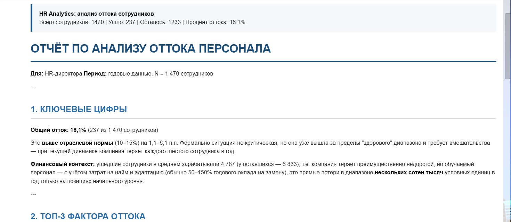
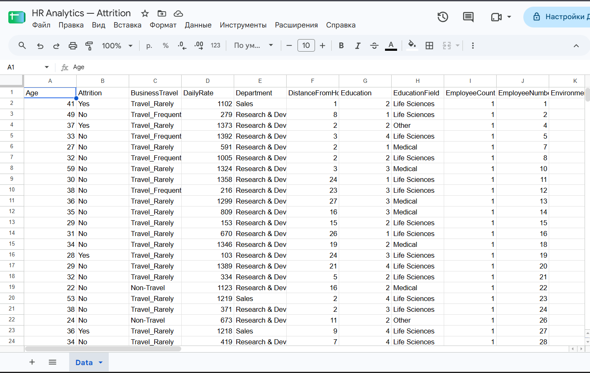
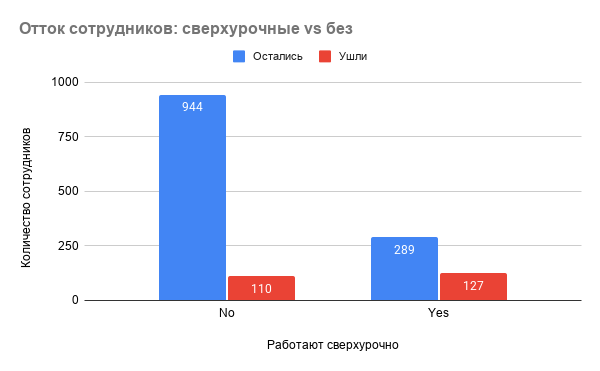
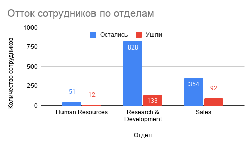
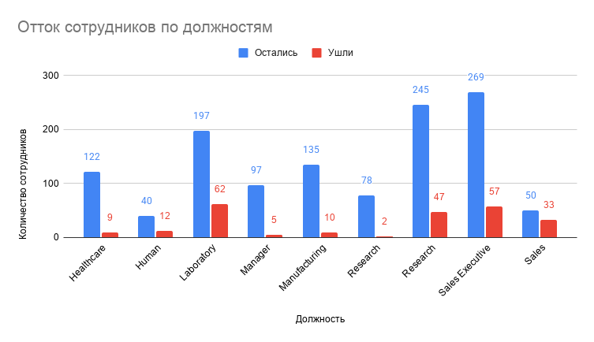
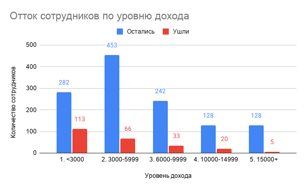
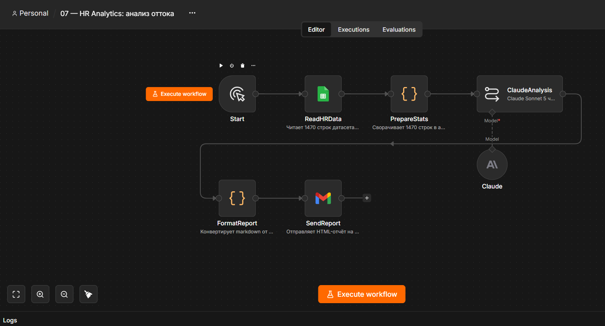

# HR Analytics: анализ оттока сотрудников

Кейс бизнес-аналитика: **автоматизированный анализ оттока персонала через n8n, Claude AI и Google Sheets**.

Демонстрирует полный цикл работы с данными: от сырого датасета до готового аналитического отчёта на email.

## Проблема

HR-директору нужно понимать, **почему уходят сотрудники** и **что с этим делать**. Но:

- Сырые данные — это 1470 строк и 35 столбцов. В них невозможно разобраться без анализа.
- Ручной анализ в Excel занимает часы и не даёт рекомендаций.
- Обычные BI-дашборды показывают цифры, но не объясняют причины.

**Задача:** построить систему, которая берёт датасет, находит ключевые факторы оттока и формирует готовый отчёт с рекомендациями — автоматически.

## Решение

Система на n8n Cloud проходит пять шагов:

1. **Чтение данных.** Узел ReadHRData забирает 1470 строк из Google Sheets (датасет IBM HR Analytics).

2. **Агрегация.** Узел PrepareStats сворачивает сырые данные в компактную статистику:
   - общие показатели (всего/ушло/осталось/процент)
   - средние значения по группам (доход, возраст, стаж)
   - 14 группировок оттока (отдел, сверхурочные, доход, стаж и т.д.)

3. **AI-анализ.** Claude Sonnet 5 получает агрегированную статистику и формирует отчёт по структуре:
   - ключевые цифры
   - топ-3 фактора оттока
   - профиль уходящего сотрудника
   - топ-5 рекомендаций

4. **Оформление.** FormatReport превращает markdown от Claude в HTML с фирменными стилями.

5. **Доставка.** SendReport отправляет готовый отчёт на email через Gmail.

## Ключевые находки из анализа

| Показатель | Значение |
| --- | --- |
| Всего сотрудников | 1 470 |
| Ушло | 237 |
| Общий отток | **16,1%** |
| Средний доход ушедших | 4 787 |
| Средний доход оставшихся | 6 833 |
| Средний возраст ушедших | 33,6 лет |
| Средний возраст оставшихся | 37,6 лет |
| Средний стаж ушедших | 5,1 года |
| Средний стаж оставшихся | 7,4 года |

### Пример отчёта

Готовый отчёт приходит на email в виде HTML-письма с фирменными стилями:



### Источник данных

Датасет IBM HR Analytics: 1470 строк, 35 признаков.



### Топ-3 фактора оттока

1. **Сверхурочные.** Отток среди работающих сверхурочно — **30,5%**, без переработок — **10,4%**. Разница: **+20,1 п.п.**
2. **Новички (стаж 0–2 года).** Отток — **36,4%** против **8,1%** у ветеранов со стажем 10+ лет.
3. **Низкий доход (до $3000/мес).** Отток — **28,6%**, против **3,8%** у сотрудников с доходом от $15000.

### Сегментный анализ

Отток сотрудников сильно различается по сегментам. Ниже — четыре среза данных.

#### 1. Сверхурочные

Сотрудники, работающие сверхурочно, уходят в **3 раза чаще**:



#### 2. Отделы

Самый высокий отток — в отделе **Sales** (20,6%). При этом R&D теряет больше всего людей в абсолютных числах (133 человека):



#### 3. Должности

Критическая точка — **Sales Representative**: уходит **почти каждый второй** (39,8%). Для сравнения: у Manager отток всего 4,9% — разница в 8 раз:



#### 4. Уровень дохода

Чёткая закономерность: чем ниже доход, тем выше отток. От **28,6%** в группе до $3000 до **3,8%** в группе от $15000 — разница в 7,5 раз:



## Схема workflow

```
Start → ReadHRData → PrepareStats → ClaudeAnalysis → FormatReport → SendReport
```

### Визуализация workflow



## Технический стек

| Инструмент | Назначение |
| --- | --- |
| **n8n Cloud** | Оркестрация всего workflow |
| **Google Sheets** | Источник данных (датасет IBM HR Analytics, 1470 строк) |
| **Basic LLM Chain + Claude Sonnet 5** | AI-анализ и генерация отчёта |
| **JavaScript (Code узлы)** | Агрегация статистики, конвертация Markdown → HTML |
| **Gmail** | Доставка готового отчёта |

## Ключевые особенности реализации

- **Агрегация на стороне кода.** Вместо того чтобы отправить Claude 1470 строк, узел PrepareStats сворачивает их в компактную статистику. Это экономит токены (в 50+ раз) и делает анализ точнее.
- **14 группировок в одном узле.** Узел PrepareStats считает отток по отделам, должностям, уровням дохода, стажу, возрасту, удовлетворённости работой, балансу работы и личной жизни — всё в одном проходе.
- **Структурированный System Prompt.** Claude не «сочиняет» свободно: промпт задаёт чёткую структуру отчёта из 4 блоков.
- **Конвертация Markdown → HTML.** Узел FormatReport превращает ответ модели в готовое к отправке письмо с фирменными стилями: синие заголовки, блок ключевых цифр, структурированные списки.
- **Идемпотентность.** Workflow можно запускать многократно — он всегда читает свежие данные из Google Sheets и формирует актуальный отчёт.

## Что демонстрирует проект

- **Аналитика данных:** работа с бизнес-метриками, агрегация, поиск закономерностей.
- **AI в бизнесе:** использование LLM не для генерации текста, а для **аналитики и формулировки рекомендаций**.
- **Автоматизация:** сквозной процесс от сырых данных до готового отчёта.
- **Работа с API:** интеграция Google Sheets, Gmail, AI Gateway через n8n.
- **Программирование:** JavaScript в Code-узлах (агрегация, конвертация форматов).

## Файлы проекта

- `workflow.json` — экспорт workflow из n8n Cloud.
- `images/` — скриншоты workflow, письма, данных.

## Автор

**Сергей Гречкин**
- GitHub: [@Puzz1eAssemb1er](https://github.com/Puzz1eAssemb1er)
